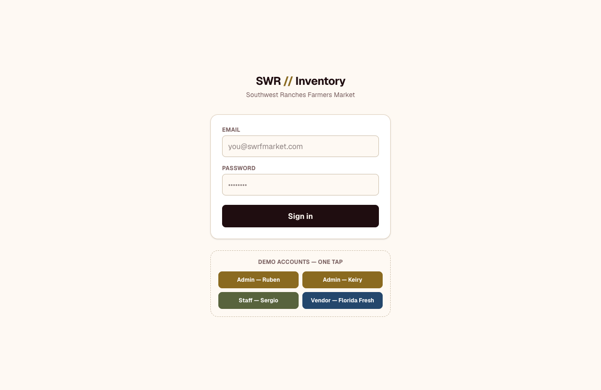
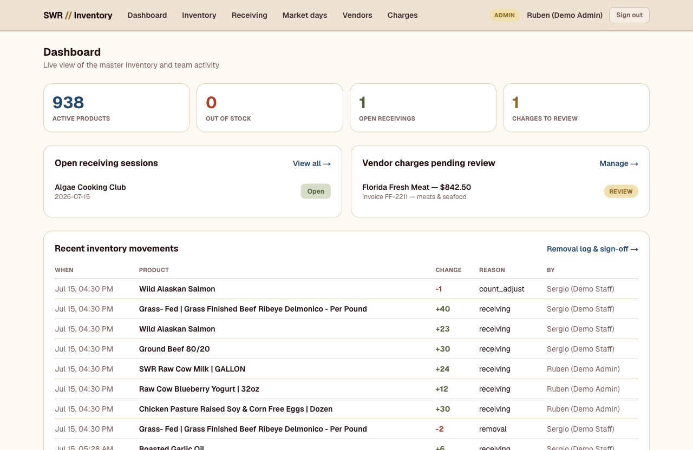
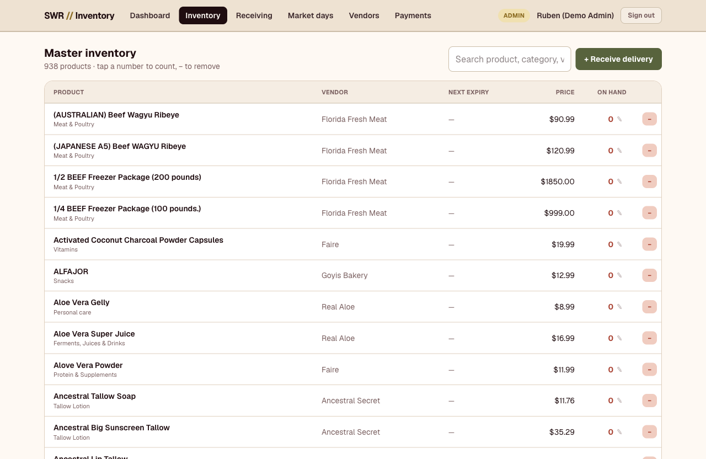
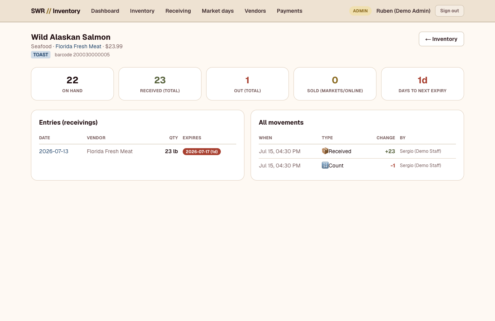
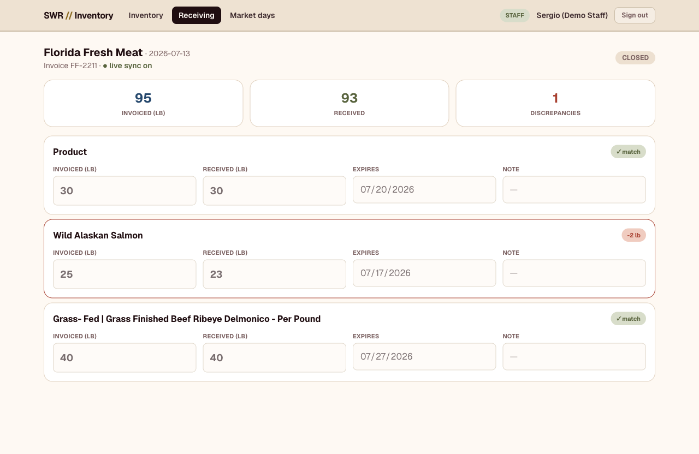
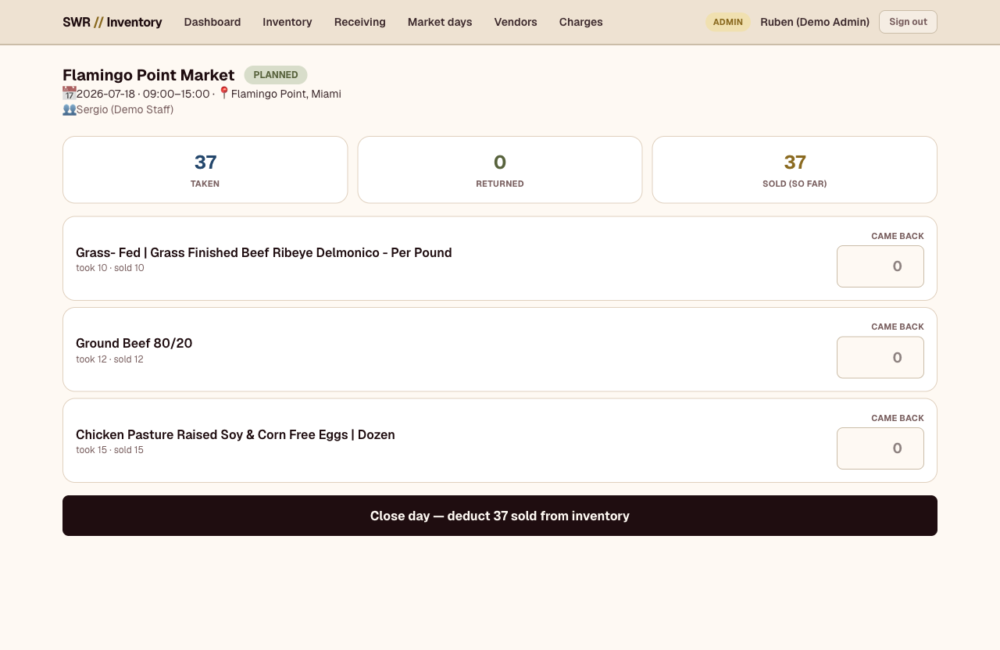
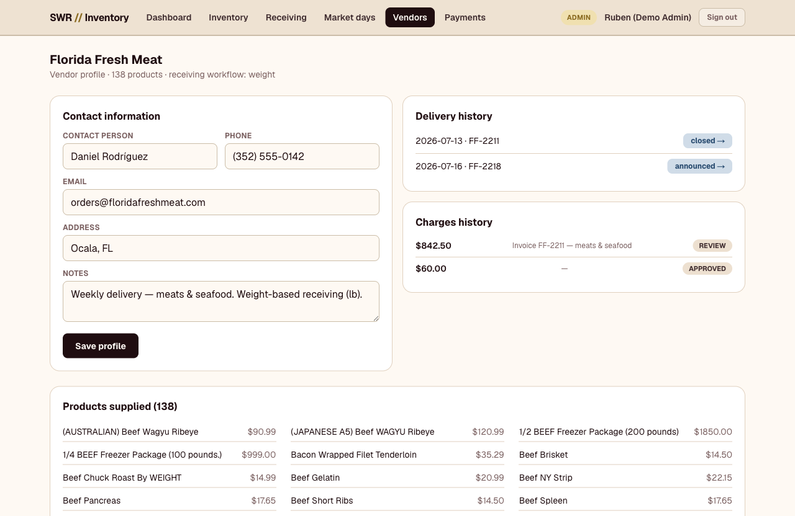
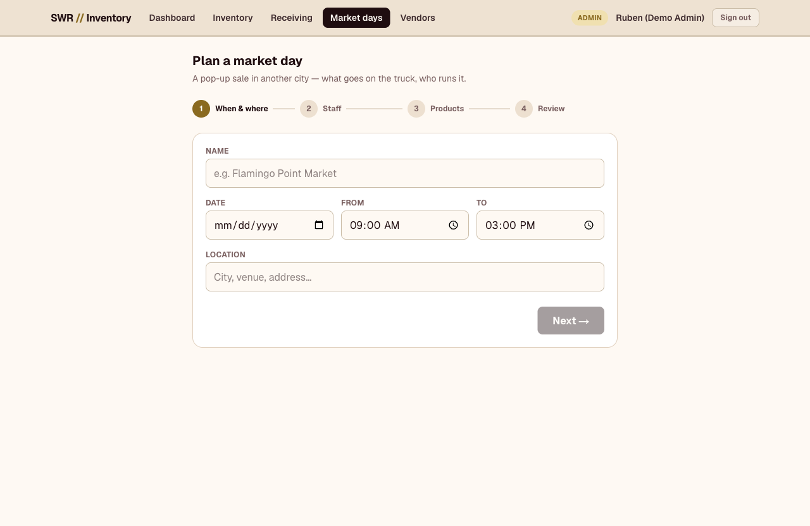
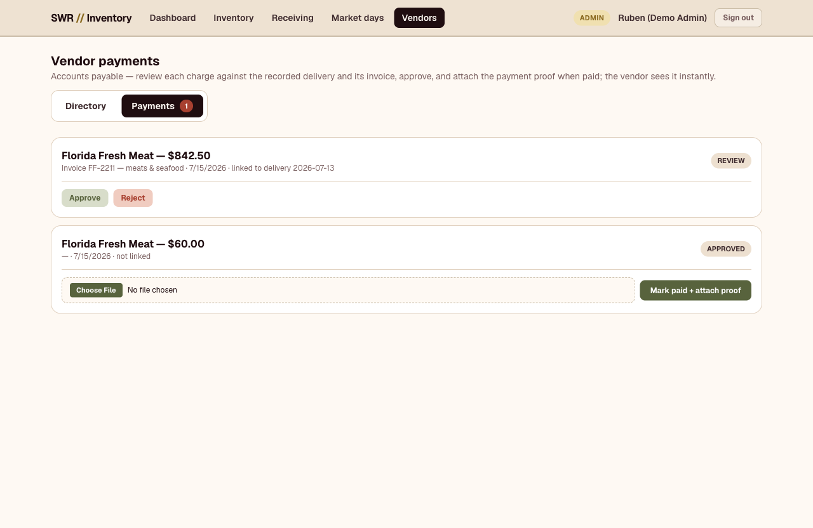
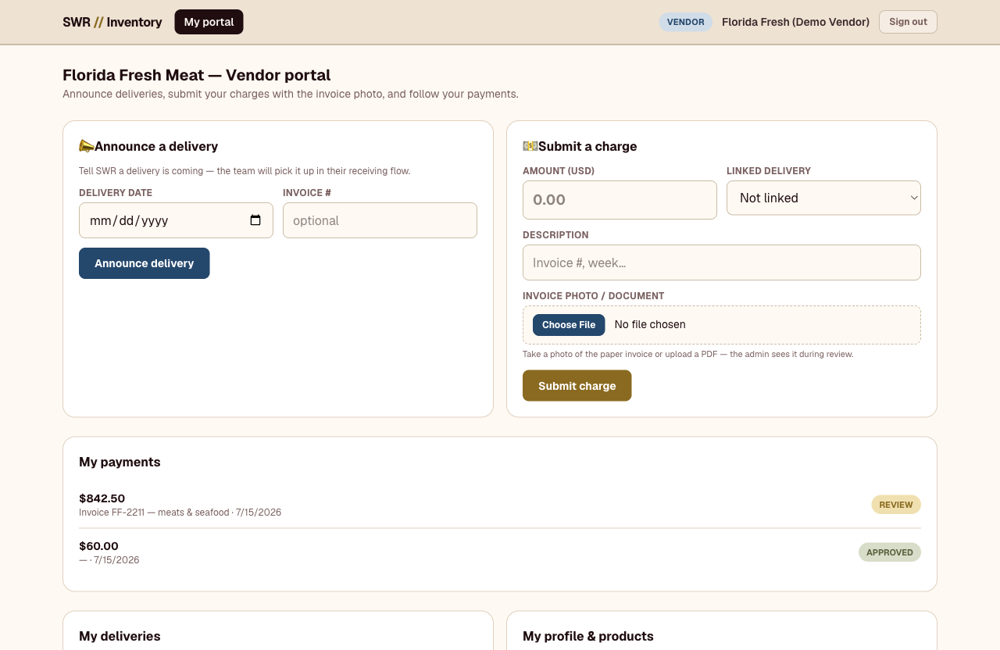

# Sistema Inteligente de Inventario — SWRFM

Inventario maestro para **Southwest Ranches Farmers Market**, desarrollado por [Ekinoxis](https://github.com/wmb81321).

Una sola fuente de verdad para el catálogo y las existencias a través de los 3 canales de venta: el mercado físico (Toast POS), la tienda en línea (Shopify) y las ventas pop-up — con cuentas por persona, edición colaborativa en tiempo real y un portal para proveedores.

> *Master inventory system for Southwest Ranches Farmers Market — one source of truth across Toast POS, Shopify, and pop-up sales.*

**Demo:** https://swrfm-demo.vercel.app

## Funcionalidades

- **Autenticación con roles** — `admin` / `staff` / `vendor` vía Supabase Auth + RLS; login sin contraseña (código OTP por correo) por defecto; tier **master** para administrar cuentas admin.
- **Catálogo sincronizado desde Toast** — los productos se identifican por `toast_guid`; Toast es el maestro de nombre y precio; los retirados se archivan (`archived_at`), nunca se borran.
- **Edición de productos** — proveedor, barcode, categoría y demás campos propios del maestro.
- **Recepción de mercancía (receiving)** — sesiones colaborativas en tiempo real (Supabase Realtime) con wizard de captura.
- **Días de mercado (pop-ups)** — planeación de items y personal por jornada, con wizard de creación.
- **Portal de proveedores** — cargos, pagos y documentos por proveedor (cuentas por pagar).
- **Retiros (removals)** — registro de mermas y salidas con atribución completa en el ledger.
- **Inventario como ledger** — cada cambio es una fila en `inventory_movements`; `inventory_levels` es el total corriente mantenido por trigger. Nada se sobreescribe en silencio.

## Capturas

| | |
|---|---|
|  |  |
|  |  |
|  |  |
|  |  |
|  |  |

## Stack

- **Next.js** (App Router, TypeScript, Tailwind CSS v4)
- **Supabase** — Postgres, Auth (roles vía RLS), Realtime, Storage
- **Vercel** — hosting y CI/CD (proyecto `ekinoxis-team/swrfm-demo`)
- **Integraciones** — Toast POS (OAuth client-credentials, Menus V2; Orders planeado) y Shopify Admin GraphQL (client-credentials, tokens de 24 h)

## Inicio rápido

```bash
git clone <repo>
cd swr-inventory-app
cp .env.example .env.local   # llena los valores (Supabase, Toast, Shopify)
npm install
npm run dev
```

Verificación durante el desarrollo: `npx tsc --noEmit` + `npx eslint` (el build completo lo corre el preview de Vercel — no localmente).

## Scripts

Todos con **cero dependencias** (fetch nativo de Node, leen `.env.local` directamente):

| Comando | Propósito |
|---|---|
| `node scripts/smoke-integrations.mjs` | Verifica credenciales Toast + Shopify (solo lectura, no imprime secretos) |
| `node scripts/sync-toast-catalog.mjs <links.json> [--apply]` | Sync del catálogo Toast con informe de conciliación; escribe solo con `--apply` |
| `node scripts/bootstrap-masters.mjs` | Crea las cuentas master admin (idempotente; requiere service role key) |
| `node scripts/seed-catalog.mjs <catalog.json>` | Semilla inicial del catálogo desde un export de Toast |

El catálogo y los datos del negocio viven **fuera del repo** — nunca se comitean.

## Despliegue

Vercel despliega automáticamente: cada PR genera un **preview** (que además valida el build) y `main` va a producción. Variables de entorno en Vercel → Project → Environment Variables.

## Documentación

- `docs/INTEGRACIONES.md` — plan de conexión Toast + Shopify (auth, APIs, webhooks, checklist de credenciales)
- `docs/CATALOGO_SYNC_HALLAZGOS.md` — hallazgos del catálogo maestro y diseño del sync
- `CLAUDE.md` — guía para trabajar en el repo con IA
- `.claude/rules/` — arquitectura, convenciones y flujo de contribución

## Propiedad

Código propiedad del cliente conforme al contrato de servicios. Repositorio documentado y estructurado para ser mantenido con IA. No se comitean secretos ni datos del negocio.
